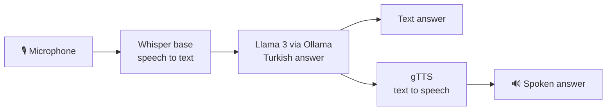

<div align="center">

# VoiceGPT

**A Turkish voice assistant with local speech recognition and a local language model.**

Speak into the microphone, get a natural Turkish answer as text and as speech.


[](https://www.youtube.com/watch?v=KPB3i5rgoHY)

*Click the image to watch the demo.*

</div>

---

## How it works



| Step | Component | Runs |
|---|---|---|
| Speech to text | OpenAI Whisper (`base` model, Turkish) | Locally |
| Answer generation | Llama 3 through Ollama, with a system prompt for short, natural Turkish | Locally |
| Text to speech | gTTS | Uses Google's TTS service, needs an internet connection |
| Interface | Gradio, with microphone input and audio output | Locally |

Your voice and your question never leave the machine. Only the generated answer text is sent to gTTS to be turned into speech.

## Screenshots


> **Question:** *"İstanbul'da gezmek için nereye gidebilirim?"*
> **Answer:** *"İstanbul'un birçok cazibe noktası var! Sultanahmet'i ziyaret etmelisiniz…"*


## Getting started

**Requirements:** Python 3.10+, [FFmpeg](https://ffmpeg.org/download.html) (needed by Whisper) and [Ollama](https://ollama.com).

```bash
# 1. Pull the model
ollama pull llama3

# 2. Clone and install
git clone https://github.com/omeraydin00/VoiceGPT.git
cd VoiceGPT/VoiceGPT
pip install -r requirements.txt

# 3. Run
python app.py
```

The interface opens at **http://127.0.0.1:7860**. Record your question and press submit.

## Customizing

- **Model:** change `model="llama3"` in `app.py` to `mistral`, `gemma` or any model you have in Ollama.
- **Speed vs. accuracy:** swap Whisper's `base` model for `tiny` (faster) or `small` / `medium` (more accurate).
- **Flagging:** the *Flag* button saves the audio, answer and spoken reply to `flagged/` as CSV for later review.

---

<div align="center">
Built by <a href="https://github.com/omeraydin00">Ömer Faruk Aydın</a>
</div>
